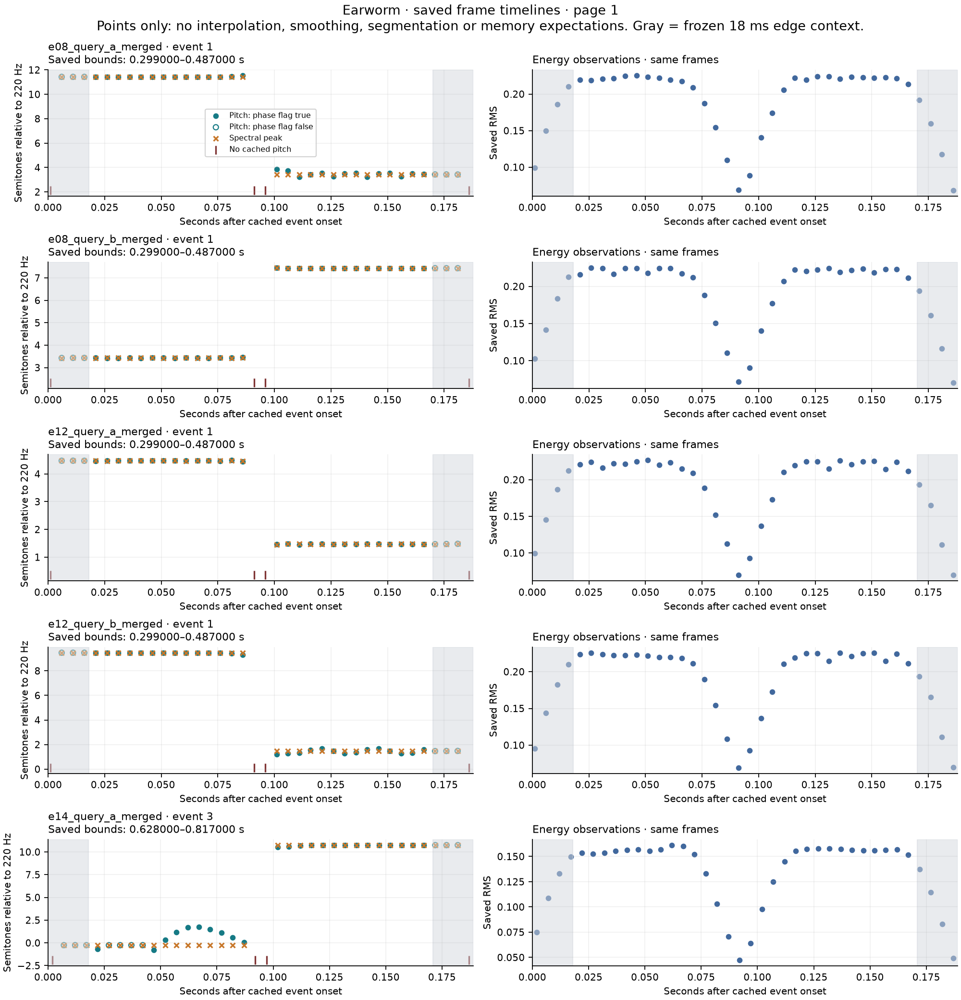
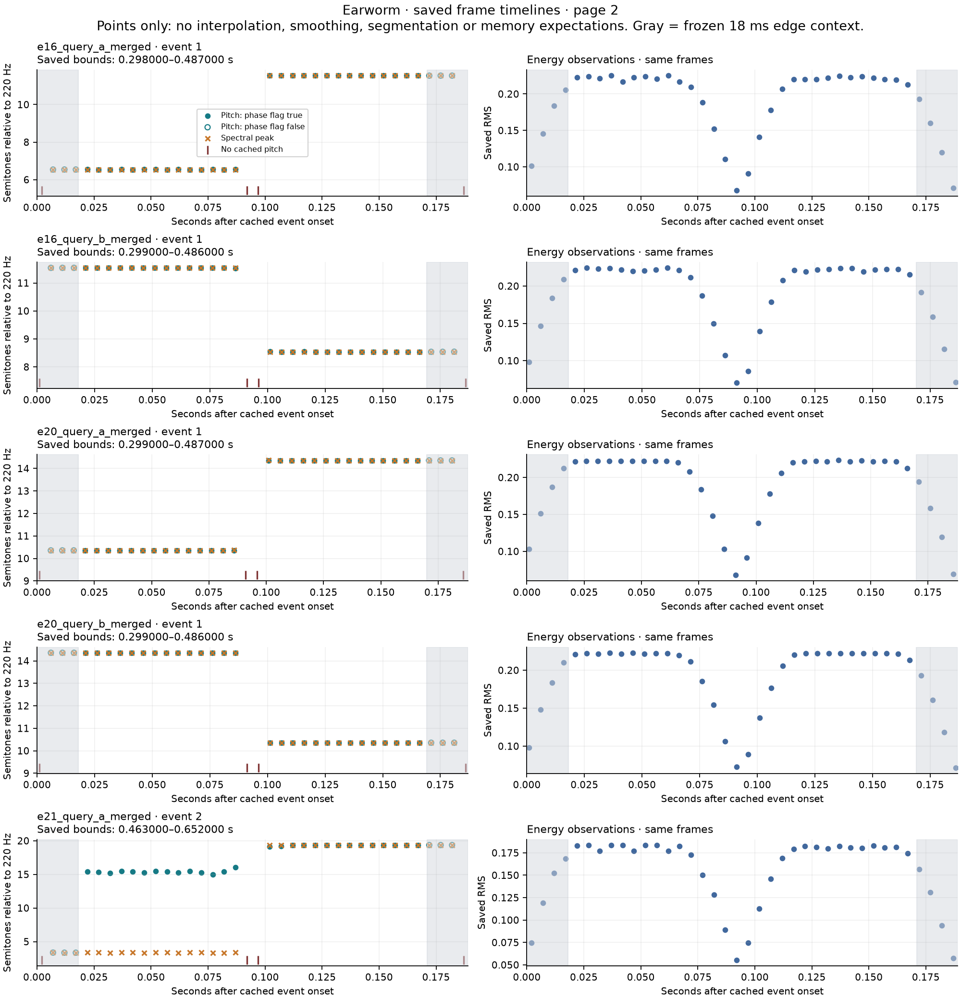

# Saved frames inside excluded events

**Ordered acoustic observations survive inside all ten cached events that the matching gate excluded.** This is a descriptive result about stored estimator outputs. Whether these observations can distinguish competing memories remains untested; retrieval decisions have not changed.

Assignment `earworm-excluded-event-frame-timelines-v1`, authorized in [PR #2 comment 5744920500](https://github.com/trinitron88/earworm/pull/2#issuecomment-5744920500). Base main: `a818d59f86cd8540399ea49f743d2d1bb0fb2736`, containing the reviewed [saved-alignment audit](../equal-vector-alignment-audit/REPORT.md).

## Coverage and descriptive result

The selection contains the exact ten excluded `merged` events from that audit, across six base phrase groups. All requested arrays were available. Each event contributes **38 chronological frames**, including **30 within the frozen 18 ms edge-excluded interior**. All **380 in-bound frames** are retained; the interior marker is context, not a new selection or gate.

Across those frames, 340 have finite positive cached pitch and a true voicing flag; 40 have NaN pitch and spectral peak. There are **276 true phase-refined flags**: 24 for `e14_query_a_merged`, 28 for each other event. RMS, dBFS energy and spectral centroid are finite at all 380 timestamps. Original float32/bool dtypes and nonfinite bytes are preserved in the [typed export](saved_frames.json); the [inventory](inventory.json) distinguishes an absent array from an available array containing NaN.

All ten receive the descriptive assessment **ordered structure visible**, rather than only a broad/unstable trace or insufficient evidence. Each has earlier and later frequency observations, separated by two central unvoiced/NaN-pitch frames and an RMS dip. This assessment comes from visual inspection of the [complete frame table](results/frames.csv) and plots, not an algorithm that discovers notes or fits boundaries. The trace is not uniformly stable, and the flags are not confidence guarantees.

Every event has NaN pitch at frame orders **0, 18, 19 and 37** (zero-based). Their positive RMS values do not establish silence. No samples are filled across these gaps. The roughly 5 ms saved grid cannot measure a trajectory between samples or a subframe transition.

## Event-level evidence

All rows below have 38 frames, 34 voiced/finite-pitch frames and 4 missing-pitch frames. “Refined” is the count of true stored flags. Bounds and ranges here are rounded for readability; [event_summary.csv](results/event_summary.csv) preserves exact bounds, energy in both RMS and dBFS, all counts, finite ranges and first/last timestamps. Event indices are zero-based. The arrows implicit in “earlier/later” describe chronological observations, not identified notes.

| Query / event | Fixed bounds (s) | Refined | RMS range | Cached pitch range (Hz) | Visible trajectory |
|---|---:|---:|---:|---:|---|
| `e08_query_a_merged` / 1 | 0.299–0.487 | 28 | 0.0683–0.2256 | 265.07–428.75 | Earlier about 426 Hz; later about 269 Hz, with visible later jitter. |
| `e08_query_b_merged` / 1 | 0.299–0.487 | 28 | 0.0703–0.2250 | 268.10–338.29 | Earlier about 268 Hz; later about 338 Hz. |
| `e12_query_a_merged` / 1 | 0.299–0.487 | 28 | 0.0696–0.2266 | 239.22–285.19 | Earlier about 285 Hz; later about 240 Hz. |
| `e12_query_b_merged` / 1 | 0.299–0.487 | 28 | 0.0693–0.2260 | 236.06–380.40 | Earlier about 380 Hz; later about 240 Hz, with visible later jitter. |
| `e14_query_a_merged` / 3 | 0.628–0.817 | 24 | 0.0473–0.1613 | 210.14–409.42 | Earlier spectral peak near 217 Hz with cached pitch wandering about 210–243 Hz; later both near 409 Hz. |
| `e16_query_a_merged` / 1 | 0.298–0.487 | 28 | 0.0677–0.2255 | 320.78–428.81 | Earlier about 321 Hz; later about 428 Hz. |
| `e16_query_b_merged` / 1 | 0.299–0.486 | 28 | 0.0704–0.2244 | 360.15–428.50 | Earlier about 428 Hz; later about 360 Hz. |
| `e20_query_a_merged` / 1 | 0.299–0.487 | 28 | 0.0677–0.2233 | 400.08–504.26 | Earlier about 400 Hz; later about 504 Hz. |
| `e20_query_b_merged` / 1 | 0.299–0.486 | 28 | 0.0717–0.2231 | 399.98–504.37 | Earlier about 504 Hz; later about 400 Hz. |
| `e21_query_a_merged` / 2 | 0.463–0.652 | 28 | 0.0553–0.1836 | 267.08–673.10 | Earlier spectral peak near 267 Hz while phase-refined cached pitch is about 524–557 Hz; later both approach 673 Hz. |

[Event assessments and limitations](event_assessments.csv) record all ten qualitative readings separately from computed summaries. No automated assessment accuracy is claimed.





The plots use points only. Teal marks cached pitch; orange marks spectral peak. Filled teal points carry a true phase-refined flag. Red ticks indicate no cached pitch. Gray shading marks the frozen edge context. Vector versions are available as [page 1](results/timelines-1.svg) and [page 2](results/timelines-2.svg).

## Uncertainty remains in the observation channels

Two examples prevent treating an ordered trace as verified fundamental frequency:

- At `e14_query_a_merged` original frame 137 (about 0.695 s), cached pitch is **243.090 Hz**, spectral peak **216.886 Hz**, and the phase-refined flag is true. Earlier-channel disagreement remains visible before both approach 409 Hz later.
- At `e21_query_a_merged` frame 95 (about 0.485 s), cached pitch is **535.426 Hz** while spectral peak is **267.138 Hz**, again with the phase flag true. Later observations approach 673 Hz. The roughly twofold disagreement is recorded without an octave correction, channel choice or claim about which estimate is right.

The physical fundamental during these disagreements, pitch in the 40 missing samples, sound between saved timestamps, human identity judgments and the cause of an alteration remain unmeasured here. No waveform was reanalyzed. These are ten correlated synthetic cases selected post hoc for a known gating limitation, not an estimate of natural-listening performance.

## Expectations stay separate

[memory_expectations.csv](memory_expectations.csv) copies **130 rows** from the preceding audit's missing-event hypotheses, with a one-based source-row map. It preserves all retained paths for these ten queries, including expectations outside the selected event bounds. The labels and expected pitches are properties of saved memory-conditioned explanations, not observed notes. They are not overlaid on plots, scored against frames or used to choose a memory. The ten original queries remain rejected under the frozen rule.

## Reproduction and integrity

[analyze_saved_frames.py](analyze_saved_frames.py) produces the three numeric tables/summary files and four plots from the scoped export. It performs only selection-preserving tabulation, finite-value summaries and the explicit unit conversion `12 * log2(Hz / 220)`. [verify_saved_frames.py](verify_saved_frames.py) independently uses Python's standard library to reconcile selection, exact typed bytes, frame values/order, fixed bounds/interior, summaries and every copied expectation row. It checks qualitative-assessment coverage, not the truth of a visual interpretation.

From this directory, with NumPy and Matplotlib available for the first command:

```sh
python analyze_saved_frames.py --out /tmp/earworm-frame-check
python verify_saved_frames.py
shasum -a 256 -c CHECKSUMS.sha256
```

Use a new output directory. These commands do not run an experiment. [export_saved_frames.py](export_saved_frames.py) additionally documents the original-cache export; it requires original local inputs that are intentionally not published in full. [Input identifiers](input_identifiers.json) retain cache hashes, full-description digests and frozen source hashes. The original run had no recorded execution Git revision; this publication is a later audit snapshot.

[Validation](validation.json) records exact local slice reconciliation, original-input preservation, independent checks and byte-identical reproduction of all seven outputs. Public readers can check the scoped export and published dependencies, but cannot independently hash the omitted full caches without those originals. [CHECKSUMS.sha256](CHECKSUMS.sha256) covers this package; prior experiment files and audit packages remain unchanged.

## One unexecuted proposal

Inspect the frozen estimator implementation and these already-saved channel/flag values to explain the provenance of the pitch-versus-spectral-peak disagreements in `e14_query_a_merged` and `e21_query_a_merged`. Keep this a bounded saved-evidence/code audit: no extraction, pitch correction, scoring or decision change. This is a proposal for review, not an authorization or completed result. The worker stops after publication.
